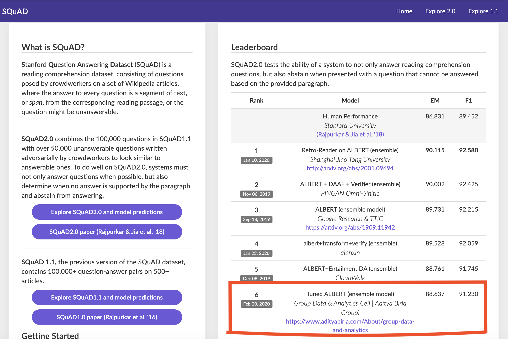

# squad-submission

### 1.  What is SQuAD

* Stanford Question Answering Dataset (SQuAD) is a reading comprehension dataset, consisting of questions posed by crowdworkers on a set of Wikipedia articles, where the answer to every question is a segment of text, or span, from the corresponding reading passage, or the question might be unanswerable.

* SQuAD2.0 combines the 100,000 questions in SQuAD1.1 with over 50,000 unanswerable questions written adversarially by crowdworkers to look similar to answerable ones. To do well on SQuAD2.0, systems must not only answer questions when possible, but also determine when no answer is supported by the paragraph and abstain from answering.

### 2. My strategy

a).  Data Pre-Processing 

* Text Preprocessing
* Tokenization
* Serialized into TFRecords

b). Tuned Albert

* Base Network(Transformer)
* Albert Architecture (Multi Headed Self Attention)
* QA Layer Architecture
* Parameter Tuning

c). Training Strategy

*   Learning Rate Decay based Training
*   Tuned Loss function after some epochs
*   Dataset Ratio Tuning(Answerable/ Unanswerable)

d). Ensembling  Strategy

*   Model 1 - with full dataset
*   Model 2 – Model 1 + Additional Dataset of specific Class
*   Bagging Technique

e.) Computation

*   100h+ DGX-GPU(2 V100)

### 3.  Submission Result

